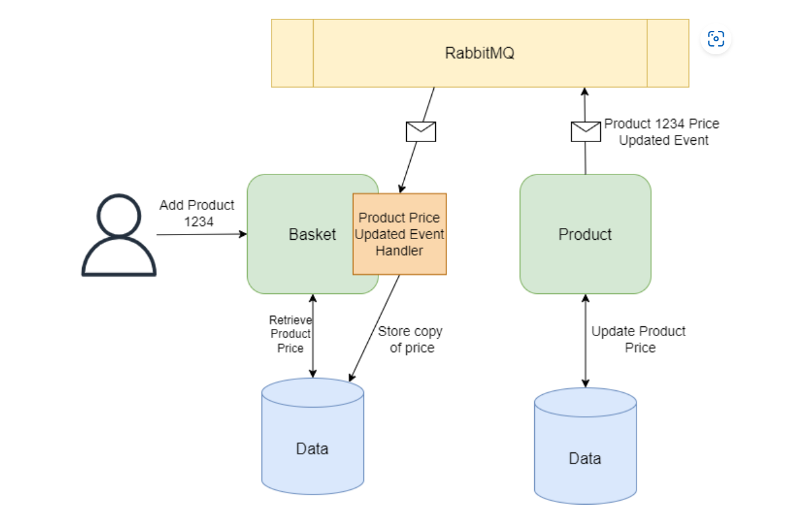
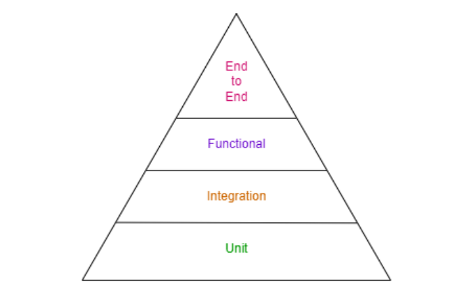

# MicroServiceArchitecture 

## 마이크로 서비스 아키텍처

### 마이크로 서비스란?

응용 프로그램 도메인의 컨텍스트 내에서 단일 초점 지점이 있는 서비스이다, 서비스는 콘솔, HTTP 기반 API, 이벤트 기반 도는 기타 유형의  프로세스라고 할수 있다.

마이크로 서비스는 그 자체로 완전한 어플리케이션을 구성하지 안흔다, 비지니스를 항목 별로 만들어 구성하게 된다.

### 마이크로서비스의 이해

**마이크로서비스 아키텍처는 여러 마이크로서비스를 결합하여 완벽하게 작동하는 시스템을 만드는 것입니다**

여기서는 구현으로 전자 상거래 에플리케이션의 아키텍처를 Order, Basket, Product API Server를 구성하여 프론트엔드를 통해 시스템과 상호 작용하는 어플리케이션을 구축할예정이다.

각 마이크로서비스는 데이터 스토어를 사용하여 작동하는데 필요한 정보를 유지하며 다른 마이크로서비스가 소유한 데이터 스토어에 연겨하지 않는다.

각 마이크로 서비스의 기능과 코드 베이스를 결합하는 것을 의미하지 않는다, API또는 이벤트를 통해 마이크로서비스가 작동하며 어플리케이션의 결합을 제공한다.

### 마이크로 서비스 장점

* 소수의 개발자가 쉽게 유지관리
  * 한가지 작업에대해서만  집중하기 떄문에 변경의 가능성이 낮다.
  * 단일 책임원칙을 고수하기 유리
  * 자체 데이터 저장소를 소유하며, 다른 서비스가 데이터와 상호 작용하는것을 허용하지 않는다.
* 지속적인 가치를 제공
  * 작은 서비스를 사용하면 서비스에 대한 더 많은 자동화된 테스트를 작성이 가능
  * 모놀리식 코드보다 외부 의존성이 적으며 모방하기 쉽다.
  * 기능별로 프로젝트를 구성하기 떄문에 새로운 기능이 구현될때 해당 프로젝트만 개발하면되고 그로인한 영향을 끼치기 어렵다
* 확장성이 뛰어나고 가용성이 뛰어남
  * 시스템과 사용자의 요구를 충족할 수 있는 능력을 의미

### 마이크로 서비스 단점

* 복잡성
  * 단일 솔루션이아닌 각 기능별로 나누어 독립적인 코드베이스를 가진다.
* 지연시간 증가
  * 다른 서비스와 느슨하게 결합되기를 원한다
    * 이벤트와 메시징을 사용하는 비동기 서비스를 선택 각 서비스들에게 메시지를 전달하게 된다.
  * 서비스간 호출을 수행시 대기시간이 늘어난다,
  * HTTP 또는 gRPC 대기시간 떄문에 하나의 프로세스로 구성된 시스템보다 느리다.
* 코드 리펙토링

### 마이크로서비스 용이한 사용법

모놀리식 아키텍쳐를 새 어플리케이션을 개발시 사용하는것이 좋다 적은 인원 적은 사용자 시 병목현상이 심한 시스템을 도입하긴 힘들다, 그러나 이미 여러개발자와 팀이 잘 구축이되엉 있다면 마이크로 서비스 아키택쳐를 선택하는것도 좋은 선택이 될것이다

## 마이크로 서비스 간의 통신

### 동기식 통신

가장 이반적인 동기 통신의 형태는 HTTP 이다, 각 프로세스가 API 서버로 구성되어 서로간 HTTP 통신을 이용해 응답을 주고받는다, 이방법은 간단하지만 송신 및 수신 의 응답이 시간이 오래 걸리는 경우 성능이 저하될 수 있다.

hTTP는 여러 프로그램간 느슨하게 통신이 이루어지며 데이터가 JSON, XML로 직렬화되어 페이로드 크기가 상당히 커질 때 대기시간이 오래거릴 수있다.

대체 동기 통신 방식으로는 원격 프로시저 호출을 수행하는 gRPC가 존재한다, 이것은 다른서비스에서 메소드를 실행 시키기 때문에 잘 정의된 계약을 가진 모놀리식에서 볼 수 있는 동작과 유사하다, 또한 이점은 데이터 페이로드가 protobuf 형식으 사용하여 바이너리로 직렬화되어 HTTP 보다 효율적이며 빠르다

### 비동기식 통신

요청자가 다운 스트림 서비스로부터 응답을 받을 때까지 차단하지 않고 폴링 혹은 웹훅을 도입하여 요청자가 데이터를 제공할 준비가 될떄마다 다운스트림으로 부터 구독된 메시지를 수신 받을수 있도록한다,

예를 들어 서비스 A는 다른 서비스 B에 요청을한다, 장기 실행 프로세스이므로 마이크로 서비스 B는 URL또는 식별자로 신속하게 응답하므로 마이크로서비스 A 가 프로세스 상태를 확인하기위한 후속요청을 처리할 수있다.

이를 통해 시스템이 보다 반응적으로 작용하여 변경 사항에 보다 효율적이고 효율적으로 대응할 수 있습니다. HTTP 폴링 또는 웹훅은 우리의 통제를 벗어난 제3자 코드가 비즈니스 요구 사항에 활용하는 공개 API가 있을 때마다 잘 작동합니다.

### 게시자 및 구독자 RabbitQ

메시지를 발행하는 서비스가 있을 때 이를 서비스 게시자라고 할 수있는데 다른 서비스에서는 게시자로부터 메시지를 수신하려는 서비스 구독자가 있다. 모든 서비스는 게시자 또는 구독자가 될 수 있다, 메시지 브로커를 이용해 게지사에게 각 구독되어 있는 서비스에게 메시지가 있음을 알리는 서비스이다, 일반적으로 게시자와 구독자를 1:다로 생각한다.

여러 이점을 얻을수 있는데

* 구독자와 개시자는 서로 완전히 분리될 수있다. 서로 알필요가 없다는 말이다, 게시자는 개시만하면되고 구독자는 데이터를 파싱만 잘하면 된다
* 비동기 통신 유형이며 메시지는 백그라운드 스레다, 에서 수신된다, 이를 통해 메시지를 보내고 받을 때 오류가 발생해도 복원이 가능하다
* 초기 아이디 비번 guest

## 게시자 구독 패턴

서비스 별 비동기 메시지 발행을 위해 Pub/Sub 패턴을 사용한다.

### RabbitMQ

메시지를 발행시 RabbitMq는 큐에 메시지를 생성하고 이벤트를 소비하는 구독자에에 CreatedEvent를 발생 시켜 받을 수 있다.

RabbitMQ 에서 메시징의 핵심은 게시자가 메시지를 대기열로 직접 보내지 않는 것이다, 게시자는 메시지가 대기열로 전달 되었는지 여부조차 알 수 없도록한다, 대신 개시자느 간단한 구성요소인 교환 에만 메시지를 보낸댜, 한쪼 끝에서는 게시자로부터 메시지를 받고, 다른 한편으로는 구독자가 사용할 수 있도록 이러한 메시지를 대기열로 푸시한다.


---

# 첫번째 프로잭트 구성

전자 상거래 도메인 구축 예정

## Basket 마이크로 서비스

장바구니 서비스.

REST API 를 준수한 API 를 구축, HTTP 보다 빠른 gRPC , 메시지 또는 큐 기반의 메시지 브로커에게 메시지를 게시할수 있도록 하는 방식으로 서비스끼리 통신을 한다.

장바구니 서비스는 HTTP REST Api 구현

docker build -t basket.service:v1.0 -f Basket.Service\Dockerfile .

docker build -t basket.service:v2.0 -f ./Basket.Service/Dockerfile .

docker run -it --rm -p 8000:8080 basket.service:v1.0

docker run -it --rm -p 8000:8080 basket.service:v2.0

## Order 마이크로 서비스

주문 서비스

RabbitMQ 메시지 브로커를이용해 메시지 전달

docker run -d --hostname rabbitmq-host --name rabbitmq -p 5672:5672 -p 15672:15672 rabbitmq:3-management

docker build -t order.service:v1.0 -f Order.Service\Dockerfile .

docker run -it --rm -p 8001:8080 order.service:v1.0

## 공유 라이브러리 만들기

```

mkdir shared-libs && cd shared-libs
dotnet new classlib -n ECommerce.Shared
```

```

dotnet add package RabbitMQ.Client -v 6.8.1
dotnet add package Microsoft.Extensions.Configuration.Abstractions -v 9.0.0
dotnet add package Microsoft.Extensions.Configuration.Binder -v 9.0.0
dotnet add package Microsoft.Extensions.DependencyInjection.Abstractions -v 9.0.0
```

공유 라이브러리르 별도의 솔루션에 있을 시 마이크로서비스와 독립적으로 버전을 지정이 가능하며, 이는 모든 소비자를 중단하지 않고 마이크로 서비스의 하위 집합에  새로운 기능을 도입이 가능하다.

마이크로 서비스에 서 사용하기 위해 이러한 공유 라이브러리를 배포하는 방법은 패키지를 개시하기 위한 것이 아니라 Nuget을 통해 배포된다.

시작하려면 공유 NuGet 패키지를 구성하기 위한 새 폴더가 필요하므로 챕터 폴더의 루트에 , 및 폴더와 함께 폴더를 만들어 보겠습니다

프로젝트의 Pack 을 해서 nupkg를 만든다

그후 지정한 폴더에 nupckg를 만든다 아래 예시

```
dotnet nuget push .\ECommerce.Shared.1.0.1.nupkg -s \\shpark_Nas\Hoon\01.Study\05.WebProjects\01.MicroServiceArchitecture\src\local-nuget-packages
```

```
docker build -t order.service:v2.0 -f order-microservice\Order.Service\Dockerfile .
docker build -t basket.service:v3.0 -f basket-microservice\Basket.Service\Dockerfile .

docker run -d --hostname rabbitmq-host --name rabbitmq -p 5672:5672 -p 15672:15672 rabbitmq:3-management

```

공유 라이브러리 버젼 관리 .csprog 파일의 **<**VersionPrefix>1.1.0</VersionPrefix**>** 를 이용해 버젼을 관리해 누겟을 관리할 수있다. 그뒤 pack 을 진행 후 다시 donet nuget 을 이용하면 된다.

docker run -d --rm -p 8001:8080 -e RabbitMq__HostName=host.docker.internal order.service:v2.0
docker run -d --rm -p 8000:8080 -e RabbitMq__HostName=host.docker.internal basket.service:v3.0

## 데이터 공유

*모놀리식에서는 저장소를 포함한 모든 데이터가 모든 코드에서 효과적으로 공유가 된다.*

일반적으로 이는 전체 코드베이스에서 동일한 데이터베이스 기술이 사용된다는 것을 의미합니다. 이것은 괜찮을 수 있지만 비정형 JSON은 NoSQL 데이터베이스에 저장되는 반면 관계형 데이터는 SQL 데이터베이스에 가장 효과적으로 저장되는 것과 같이 특정 유형의 데이터는 다른 데이터베이스에 저장하는 것이 더 적합합니다.

마이크로서비스를 사용할 때 이러한 데이터 요구 사항 결정을 보다 세부적인 수준에서 내릴 수 있습니다. Basket 마이크로 서비스와 같은 마이크로 서비스가 고객을 위한 임시 바구니 데이터만 저장하고 복잡한 조인이나 쿼리가 필요하지 않다고 가정합니다. 이 경우 Redis와 같은 더 빠르고 가벼운 데이터베이스를 활용할 수 있습니다.

### 마이크로 서비스간 데이터 공유

*마이크로 서비스가 사용한느 데이터는 작동하는데 필요한 데이터만 사용해야한다* 예를 들면 Basket 서비스는 고객의 결제 세부정보를 신경 쓸필요가 없으므로 데이터 저장소에 이 정보가 필요치 않다. 고객을 위해 장바구니 세부정보를 저장하는것과 관련이 있으므로 해당 데이터만 관리하고 저장해야한다. 그러나 다른 정보를 저장할 수 없다는것은 아니다.

예를들면 특정 제품에 대해 여러개를 구미시 할인을 제공하는 프로모션을 도입한다면, 현재 Basket 서비스에는 제품가격 책정에 대한 개념이 없지만, 이경우엔 바구니의 총가치를 표기해야한다. 이를 달성하려면 두가지 방법이 있다

* 고객이 Basket 서비스에서 제품을 추가 시 제품 서비스에 HTTP GET 요청을 하여 가격 정보를 검색하여 할인을 계산할 수 있다.
* 두 마이크로서비스 사이에 결합을 만듭니다.
* HTTP GET 요청이 동기식이기 때문에 효율적이지 않으며 고객이 장바구니에 제품을 추가하거나 제거할 때마다 이 작업을 수행하고 싶지 않는데, 대신 *Basket 데이터 저장소에 있는 제품 가격 정보의 복제본이 필요하다*


* 메시지 브로커를 이용하여 비동기 작업을 수행 할 수 있다, 이는 Basket서비스에 대한 솔루션으로, 제품 가격에 대한 업데이트를 받고 데이터 사본이 최신인지 확인한다.
* Basket 마이크로 서비스는 제품 가격 데이터에 대해 내부 작업을 수행하지 않습니다. 이 정보를 업데이트할 수 있는 유일한 경우는 제품 마이크로 서비스의 이벤트에 의해 이 정보를 업데이트하도록 트리거될 때입니다. 이러한 방식으로 제품 마이크로 서비스는 제품 가격과 관련된 데이터를 계속 소유합니다.



### Docker Compose 이용하기

RabbitMQ와 마찬가지로 Docekr Container 에서 SQL Server 등 RDB를 실행하도록 선태 할 수있다. 이를 통해 SQL 엔진을 설치할 필요 없으며 개발환경을 깨끗하게 유지할 수 있다. 더욱이 우리는 현재 Docker에서 다양한 서비스를 실행하는 단계에 있으며, 모든 명령과 포트매핑을 관리하는 것이 지저분해진다,

다행히도 Docker Compose의 형태로 해결을 할 수 있다.

### Docker Compose 구성

Dcker Compose는 다중 컨테이너 애플리케이션을 정의하고 실행하는 Docker 도구이다, Docker Compose를 사용하면 단일 명령으로 모든 서비스를 실행할 수 있다. 이전과 같이 Dockerfile과 이미지를 정의하지만 이제 포트 매핑, 환경 변수 또는 기타 구성과 함께 필요한 모든 서비스를 정의하는 YAML 구성 파일을 한다.

```
services:
  sql:
    container_name: sql 
    image: mcr.microsoft.com/mssql/server:2022-latest
    ports:
      - "1433:1433"
    environment:
      - "ACCEPT_EULA=Y"
      - "MSSQL_SA_PASSWORD=micR0S3rvice$"

```

DB Migragtion

```
dotnet add package Microsoft.EntityFrameworkCore.Design
dotnet add package Microsoft.EntityFrameworkCore.Tools
dotnet tool install dotnet-ef --global -–version 9.0.0
dotnet add package Microsoft.EntityFrameworkCore.Design -v 9.0.0
dotnet ef migrations add Initial -o Infrastructure\Data\EntityFramework\Migrations
dotnet ef migrations add Initial -o Infrastructure\Data\EntityFramework\Migrations -p YourDbProjectPath -s YourStartupProjectPath

dotnet ef database update
```

docker build -t product.service:v1.0 -f .\product-microservice\Product.Service\Dockerfile .

## Basket Micro Service 기능 확장

제품의 가격을 저장할 곳이 필요하며 캐시는 Basket 서비스를 위해 사용된다.

docker compose 에 Redis 항목  및 Basket 서비스 추가

```
redis:
  container_name: redis
  image: redis:6.2-alpine
  ports:
    - "6379:6379"
basket:
  container_name: basket
  build:
    context: .
    dockerfile: ./basket-microservice/Basket.Service/Dockerfile
  ports:
    - "8000:8080"
  environment:
    - "RabbitMq__HostName=host.docker.internal"
    - "Redis__Configuration=host.docker.internal:6379"
```

## 테스트



### 단위 테스트

단일 서비스의 일부분만 처리한다.

예를 들면 장바구니에 제품을 추가하면, 바구니 합계가 올바르게 계산이 되는지 확인하는것과 같이 마이크로 서비스 내에서 작은 기능 조각의 동작을 확인하는 역할을 한다

### 통합테스트

유닛 테스트는 우리가 작성한 작은 기능에 초첨을 맞추지만, 통합테스트는 종속 모듈 또는 구성요소가 혼잡에 포함이 된다.

예를 들면 제품 서비스에서는 제품 정보를 저장하기위해 데이터 베이스와 상호 작용을 한다, 그러나 이것이 올바르게 작동하는지 확인하는 것을 말한다.

### 기능 테스트

기능이나 마이크로 서비스를 구현하도록 유발한 기능 요구사항을 고려할 때이다, 이는 단일 마이크로 서비스의 범위를 넘어서며, 잠재적으로 여러 마이크로 서비스 및 인프라 구성 요소를 포함하여 요구사항에 대한 기능의 동작을 확인한다,

예를들면 공통 라이브러리에 최신 기능을 사용하여 바구니 합계를 고객 장바구니의 표시 하는 기능에는 몇가지 구성 요소가 있다, 우선 제품 서비스가 메시지 브로커에 제품가격에 대한 업데이트를 게시한다, 여기서 장바구니 서비스가 이 이벤트를 수신하고 Redis 캐시에 저장한다

마지막으로, 고객이 바구니를 만들때 마다 캐시에서 제품가격을 검색하고 총 값을 표기한다,

이 기능의 일부를 독립적으로 테스트 가능하지만, 기능테스트를 작성하지 않는 한 전체 기능으로 작동한다고 확신이 불가능하다, 이러한 테스트에서 많은 구성요소가 도입되기 시작하면 테스트가 복잡해진다

### 엔드-투-엔드 테스트

여러 마이크로 서비스에 걸쳐 어플 내에서 전체 사용자 여정을 다시 한 번 테스트한다.

예를 들어 전자 상거래 어플에서 제품을 만들고, 고객이 이를 장바구니에 추가하고 주문 마이크로 서비스를 활용 결제를 계속 할 수 있다.

이런 작업을 완료하기 위해 고객 인증이 필요한경우 이는 E2E 테스트에 포함 할 수 있는 또 따른 기능이 된다, 해당 테스트에는 여러 구성 요소가 포함되고 사용자 인터페이스가 포함되는 경우가 많기 떄문에 불안정 할 수 있다. 사용자 인터페이슨ㄴ 소량이라도 정기적으로변경되며, E2E 테스트를 작성하는데 사용되는 소프트웨어는 상호 작용할 수 있는 특정 UI 구성요소에 의존하다, 이 소프트웨어는 애플리케이션과 상호 작용하는 사용자를 효과적으로 모방하지만 프로그래밍 방식으로 수행한다.

### 테스트

* 아래와 같이 단일 메서드만 테스트 시 cli 를 이용해 가능하다.

dotnet test --filter DisplayName=Basket.Tests.CustomerBasketTest.Domain.GivenCustomerBasketWithProduct_WhenCallingAddBasketProductWithExistingProduct_ThenBasketUpdated

* 아래를 프로젝트에 설정한다면 internal 선언 한 클래스를 사용이 가능하다

`<InternalsVisibleTo Include="Basket.Tests" />`

## 서비스 추적 시스템 (Observability)

마이크로 서비스가 프로덕션 환경에서 어떻게 수행되고 있는지 체크하고 추적할 수 있다. 관찰 가능한 구성요소를 원격 분석이라고 하고 자세히 다뤄본다.

### (Trace) 추적

요청의 출처가 어디든 상관 없이 서비스가 요청을 수신할 때 무슨 일이 일어나는지 대략적으로 파악이 가능하게 해준다, 데이터 겁색을 위해 데이터베이스와 통신하거나, 다른 서비스에 HTTP 호출을 할 떄 와 같이 서비스경계를 넘나들며 추적할 수 있다, 추적은 일련의 스팬으로 구성이 되는데, 스팬은 요청 범위 내에서 발생하는 단일 이벤트로, 예를 들면 서비스가 HTTP 요청을 보내거나 메시지 브로커에 이벤트를 개시 할 때마다 발상한다, 스팬은 추적의 구성요소이며 키 - 값형식의 여러정보를 포함한다.

```
{
  "name": "HTTP Request Received",
  "context": {
    "trace_id": "0x5b2ab5a1d2c8092f8111cf37308d39aa0",
    "span_id": "0x067581af3cb53c11"
  },
  "parent_id": null,
  "start_time": "2024-06-25T14:31:38.114101Z",
  "end_time": "2024-06-25T14:31:40.114231Z",
  "attributes": {
    "http.route": "/1"
  }
"events": [
    {
      "name": "Retrieving Product from database",
      "timestamp": "2024-06-25T14:31:39.123199Z",
      "attributes": {
        "event_attributes": 1
      }
    }
  ]
}
```
여기서 핵심 정보로 첫번째는 두개의 자식 속성을 포함하는 Context 속성이다. 추적을 구성하기 위해 범위를 결함하는데 사용되는 고유 식벽자이다, 이 값은 서비스간 전달되므로 요청 컨텍스트 내에서 생성된 모든 범위가 올바르게 연결된다. 'trace_id' 다음으로, 특정 이벤트에 대한 고유 ID를 제공한다, 'parent_id' 필드를 보면 null 임을을 알수 있다, 이는 *루트 스팬* 이라는 요청의 시작을 나타낸다, 여기서 HTTP 호출에 대해 존재할 속성과같이 범위에 컨텍스트를 제공하는 몇가지의 추가 속성이 있다, 'span_id', 'http.rout' 등

### Metrics

추작은 사용자 요청을 분석하는데 유용하지만 서비스의 전반적 성능에 대한 데이터를 수집시에는 용이하지 않다 이떄 Metrics가 작동한다, **메트릭은 일정 시간동안 캡처하고 집계하는 서비스 내의 데이터 포인트를 측정** 한다 이러한 데이터 요소를 사요하여 새로운 기능을 출시 시 서비스 성능이 더 좋거나 나빠지는지 평가를 할 수 있다.

CPU, 메모리 사용량 같은 간단한 성능 메트릭에서 요청/응답 시간  심지지어 얼마나 많은 주문을 받았는지에대한 특정 도메인에 대한 사용자 지정 메트릭까지 다양한 정보를 수집이가능ㅎ다. 


### Logging

문제 발생시 로그를 사용하면 발생한 시점의 타임스템프와 함께 몇가지 컨텍스트 정보와 심각도에 따라 문제를 기록 할 수있다. 

### 오픈텔레메트리

OpenTelemetry가 작동합니다. 모든 관찰 가능성 도구 또는 프로그래밍 언어가 데이터를 생성하거나 수집할 때 따라야 하는 API와 규칙을 정의합니다. 원격 분석 데이터 형식의 이름 지정이 표준화되도록 하는 의미 체계 규칙과 이 원격 분석 데이터의 모양을 정의하는 프로토콜(OTLP)을 제공합니다.

### 실제 적용

ECommerce.Shareed 프로젝트에 아래와 같은 누겟 패키지 설치하여 적용
```
dotnet add package OpenTelemetry.Extensions.Hosting -v 1.9.0
dotnet add package OpenTelemetry.Instrumentation.AspNetCore -v 1.9.0
dotnet add package OpenTelemetry.Exporter.Console -v 1.9.0
```
